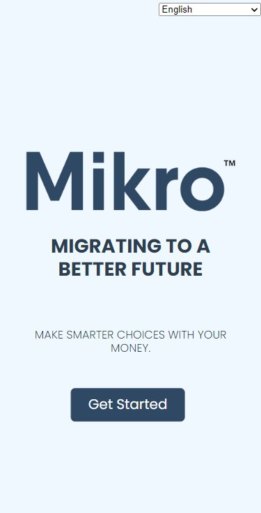
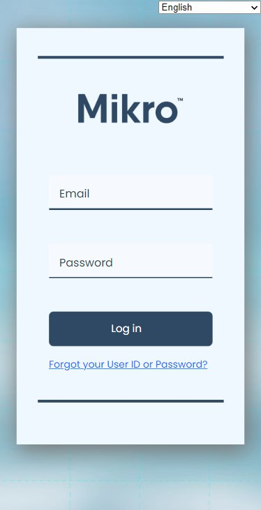
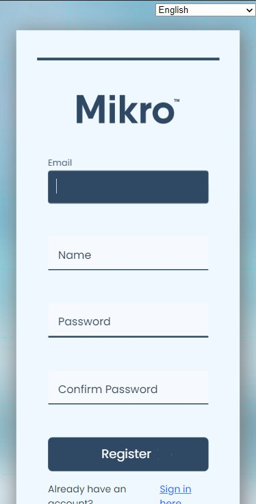
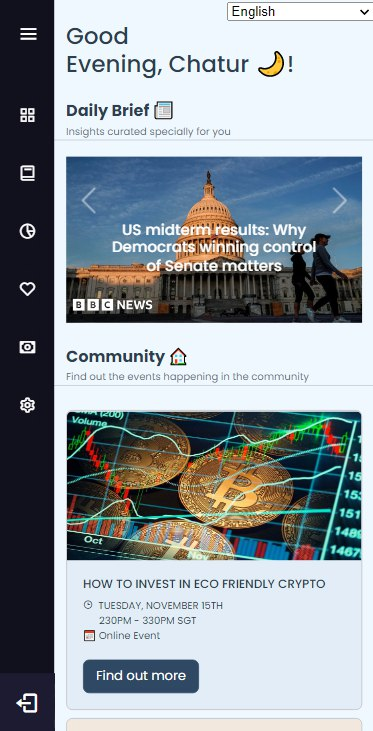
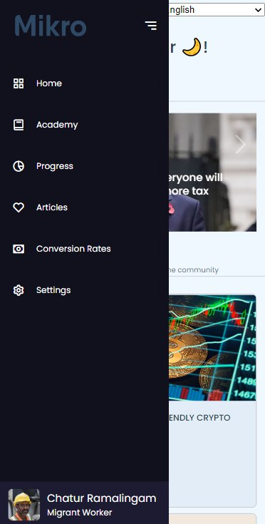
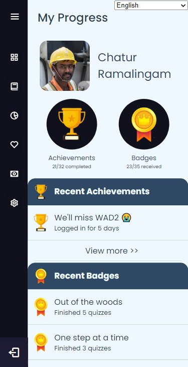
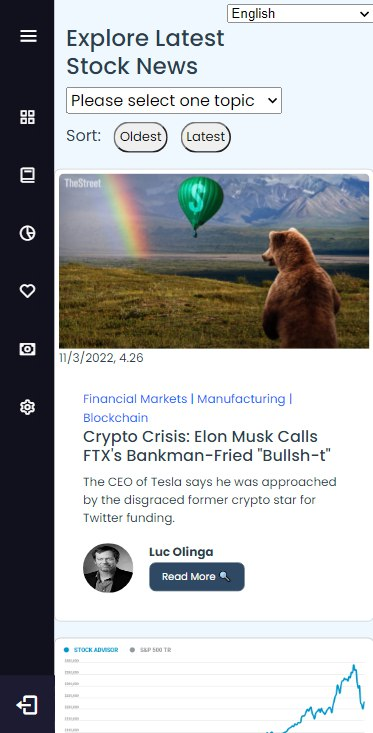
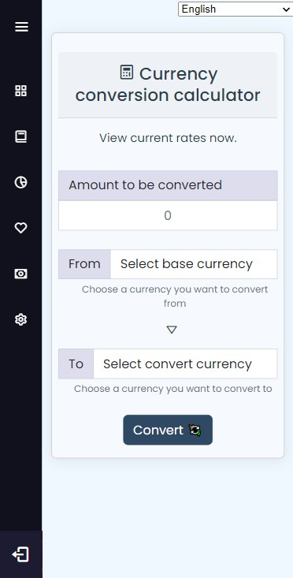
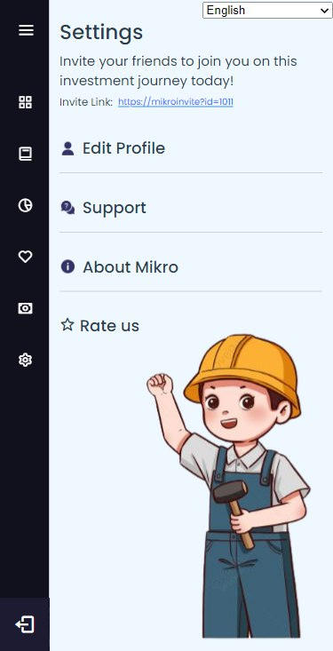

# IS216 - G6T6 Mikro

<div align="center"  style="background-color:white;">
  <a href="https://github.com/qwtan98/DJMV-IS216Project">
    
  </a>

<!--<h3 align="center">Mikro</h3> -->

  <p align="center">
    Mikro is a one-stop knowledge investment platform to increase financial inclsuion and literacy among migrant workers in Singapore, that helps to kickstart and improve their knowledge on investing. 
    <br />
    <a href="https://github.com/qwtan98/DJMV-IS216Project"><strong>Explore the docs »</strong></a>
    <br />
    <br />
    <a href="https://github.com/qwtan98/DJMV-IS216Project">View Demo</a>
    ·
    <a href="https://github.com/qwtan98/DJMV-IS216Project/issues">Report Bug</a>
    ·
    <a href="https://github.com/qwtan98/DJMV-IS216Project/issues">Request Feature</a>
  </p>

</div>

## Member Information

| Members               | School Email     | Email                           | LinkedIn                                                     |
| --------------------- | ---------------- | ------------------------------- | ------------------------------------------------------------ |
| Jane Lim Enqi         | janelim.2021     | janelim2001@gmail.com           | [@LinkedIn](https://sg.linkedin.com/in/limenqi01)            |
| Tan Quan Wah          | quanwah.tan.2021 | qwtan98@gmail.com               | [@LinkedIn](https://sg.linkedin.com/in/qwtan98)              |
| Sim Jia Cheng Malcolm | malcolm.sim.2021 | malcolmsim7@hotmail.com         | [@LinkedIn](https://sg.linkedin.com/in/malcolm-sim-protocrux) |
| Dexter Ong Qing Yang  | dexter.ong.2021  | dexter.ong.2021@scis.smu.edu.sg | [@LinkedIn](https://sg.linkedin.com/in/dexter-ongqy)         |


<!-- TABLE OF CONTENTS -->

[TOC]


<!-- ABOUT THE PROJECT -->

## Project Overview

[Go To Top](#is216---g6t6-mikro)

### Our Problem Statement

Today, the majority of migrant workers don't have easy access to resources for expanding their investment knowledge, which restricts their capacity to grow their wealth. They are faced with the constant challenge to find an essential platform where they can convieniently grow their investment knowledge.

### About the Project
Mikro is a one-stop knowledge investment platform to increase financial inclsuion and literacy among migrant workers in Singapore, that helps to kickstart and improve their knowledge on investing. 

### Project Structure

```
📦DJMV-IS216Project
 ┣ 📂 mikro-app
 ┃ ┣ 📂 dist
 ┃ ┣ 📂 docs
 ┃ ┣ 📂 node-modules
 ┃ ┣ 📂 public
 ┃ ┣ 📂 img
 ┃ ┃
 ┃ ┣ 📂 src
 ┃ ┃ ┣ 📂 assets
 ┃ ┃ ┣ 📂 components
 ┃ ┃ ┃ ┣ 📜 NavigationBar.vue
 ┃ ┃ ┃ ┣ 📜 TheFooter.vue
 ┃ ┃ ┃
 ┃ ┃ ┣ 📂 router
 ┃ ┃ ┃ ┣ 📜 router.js
 ┃ ┃ ┃
 ┃ ┃ ┣ 📂 views
 ┃ ┃ ┃ # 11 different pages
 ┃ ┃ ┃ ┣ 📜 RegisterPage.vue
 ┃ ┃ ┃ ┣ 📜 ConversionPage.vue
 ┃ ┃ ┃ ┣ ...
 ┃ ┃ ┃
 ┃ ┃ ┣ 📜 App.Vue
 ┃ ┃ ┣ 📜 main.js
 ┃ ┃
 ┃ ┃ # dependencies for the vue app
 ┃ ┣ 📜 package.json       
 ┃ ┣ 📜 package-lock.json
 ┃ ┣ 📜 package-lock.json
 ┃ ┃
 ┃ ┃ # js config files
 ┃ ┣ 📜 vue.config.js
 ┃ ┣ 📜 babel.config.js
 ┃ ┃ # gitignore
 ┃ ┗ 📜.gitignore
 ┃
 ┗ 📜 README.md
```


## Technologies Used

[Go To Top](#is216---g6t6-mikro)

### Front End Development (Core Libraries)

> Front End was developed on Node with VUE-CLI.

| Library   | Description                           | Link                                   |
| --------- | ------------------------------------- | -------------------------------------- |
| VUE-CLI   | Framework                             | [Vue CLI](https://cli.vuejs.org/)      |
| Vuex      | State Management                      | [Vuex](https://next.vuex.vuejs.org/)   |
| Bootstrap | Tooltips, Toasts, Offcanvas, Carousel | [Bootstrap](https://getbootstrap.com/) |

### Front End Styling

> Bootstrap was the Main Library for styling

| Library / Tool | Description          | Link                                   |
| -------------- | -------------------- | -------------------------------------- |
| Bootstrap CSS  | Grid, Flex Utilities | [Bootstrap](https://getbootstrap.com/) |

### Back End (Core Libraries)

> Back End is coded in Javascript with NodeJS.

| Library | Description                                                | Link                             |
| ------- | ---------------------------------------------------------- | -------------------------------- |
| NodeJS  | Open-source, cross-platform JavaScript runtime environment | [NodeJS](https://nodejs.org/en/) |

### Version Control

> Project files are hosted on Github 

| Service | Description                                         | Link                         |
| ------- | --------------------------------------------------- | ---------------------------- |
| Github  | Version Control collaborative environment using Git | [Github](https://github.com) |

### External API, Libraries and Extras

| Library / Tool       | Description                                          | Link                                                         |
| -------------------- | ---------------------------------------------------- | ------------------------------------------------------------ |
| Alpha Vantage API    | Provide stock articles news and information          | [Alpha Vantage API](https://www.alphavantage.co/documentation) |
| ExchangeRate API     | Provide latest exchange rates                        | [ExchangeRate API](https://app.exchangerate-api.com/dashboard) |
| Google Firebase      | Real-time Database and Authentication                | [Google Firebase](https://firebase.google.com)               |
| vue-google-translate | Translate content corresponding to selected language | [vue-google-translate](https://www.npmjs.com/package/vue-google-translate) |
| Bootstrap Studio     | Drag and Drop designing of pages                     | [Bootstrap Studio](https://bootstrapstudio.io)               |
| Typora               | README Editing and Formatting                        | [Typora](https://typora.io)                                  |

## How to Install and Run Our Web Application (for Developers) ##

[Go To Top](#is216---g6t6-mikro)

### Project Setup

##### Tools Required

| Tool   | Download                                           |
| ------ | -------------------------------------------------- |
| NodeJS | [Download NodeJS](https://nodejs.org/en/download/) |

### Installing Libraries

##### Front End (Vue)

```
# From Project Root Change Directory to the mikro-app folder (The Folder with package.json)

cd mikro-app

# Install Dependencies for npm

npm i
```

### Running the Development Server

```
# From Project Root Change Directory to the mikro-app folder (The Folder with package.json)

cd mikro-app

# Start the development server

npm run serve
```

Open a browser (preferably Google Chrome) and enter http://localhost:8080/ to access Mikro!

##### Login Credentials

| Email         | Password |
| ------------- | -------- |
| ape@gmail.com | apeape   |

### Preferred Devices

Samsung Galaxy S8/S9

- System: Android
- Viewport (width x height): 360px x 740px

iPhone 7 and iPhone 8

- System: IOS
- Viewport (width x height): 375px x 667px 

We chose these devices as the phones are inexpensive and not modern, which are the conditions common amongst the phones of our target user base of Foreign Domestic Workers (FDW).

## How to Use Our Web Application

[Go To Top](#is216---g6t6-mikro)

When users visit the site for the first time, this is the screen they will see:



Followed by Log In or Register depending on their status as a user:




After successfully logging into through our Firebase Authentication, users will get to the Home Page:



> Here, they are greeted by the headlines in the financial industry and events in their community

On the left of the Home Page, you can open up our Navigation Bar to access the other features:



Such as our Financial Academy:


User Progress:



Financial Articles:



Live Currency Converter Calculator:



Settings:



[Go To Top](#is216---g6t6-mikro)
